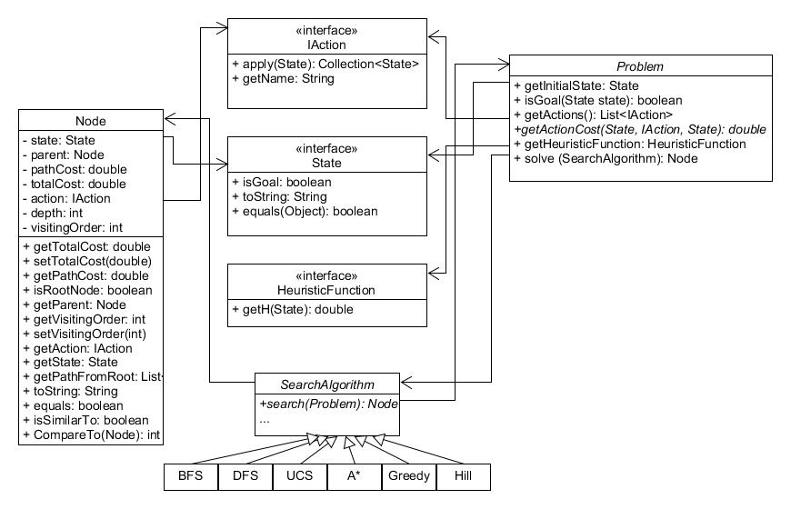
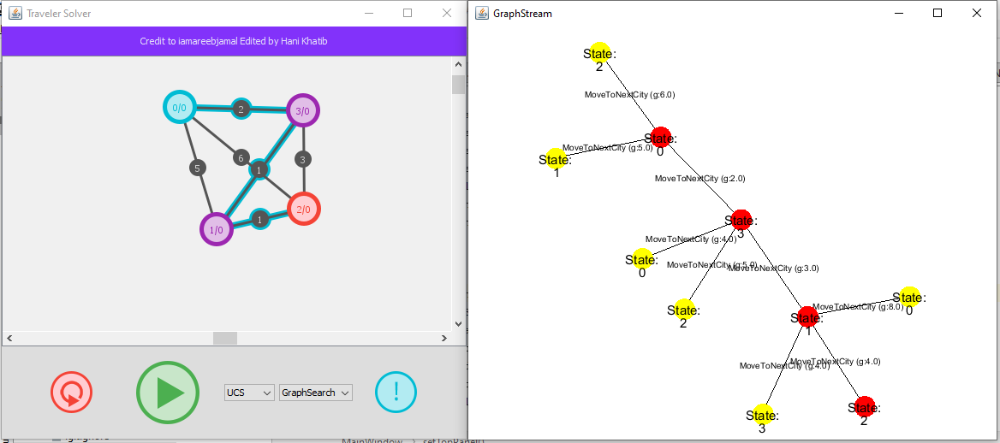

# search-algorithms
Basic Search algorithms with gui to draw graph and search tree

# Table of contents 
- problem definetion.
- Code structure.
- Algorithms.
- examples.

## Problem Definition:
to formulate a problem we need to identify five things:
1. State space.
2. Initial State.
3. Goal State (Goal test).
4. Actions.
5. Step Cost (path cost).

and hence to model the problem we need to: (from more details check out the examples.)
1. implements ```State``` interface and store the state space represntation.
2. Implements ```IAction``` interface for each action idenfied.
3. extends  ```Problem``` class and suit it up with required actions,costs,and states.
4. Implements ```HeuristicFunction``` if problem can use huristics and algorithm accept huristics(i.e A*).

## Code structure


## Algorithms

the basic Idea for any search strategy is to traverse the problem graph in some priorty order expanding nodes and checking for the goal, so its routine can be sumrised with three basic operations:
 1. _pick_ the proper node according to the strategy.
 2. _check_ if the picked node's state is the goal state, if so terminate and return that node.
 3. otherwise _expand_ the picked node by applying all actions.
 
All algorithms can run in one of two modes, **tree search**( allow an already expanded(visited) node to expanded again) and **graph search** (visit every node only once). 

By default when creating an instance of an algorithm its default behavior is tree search for example `SearchAlgorthm bfs = new BFS()` this is equal to `SearchAlgorthm bfs = new BFS(false)` if `true` is passed to constructor it will run in graph search mode.

Search Algorihms can be devided to two groups Blind (the strategy doesn't have any idea about where is the goal located) and Informed (the strategy have some knowledge about how its form the goal with help from a _heuristic_ funtion).

The Heuristc Function provides and optimistic approximation of how far is a state from the goal.

### Blind Search Algorithms

#### Bredth First Search (BFS):
Expand Nodes Level by level, the older node is expanded first, this can be achived with the power of FIFO (Queue).
#### Depth First Search (DFS):
Expand Nodes branch by branch, the newer node is expanded first, this can be achived with the power of LIFO (Stack).
#### Uniform Cost Search (UCS):
Expand the node that has the smallest path cost first `g(x)`, this can be achived with the power of PriortyQueue<g(x)>.  

### Informed Search Algorithms

#### Greedy Best First Search (Greedy):
Expand the node that has the smallest heuristc cost first `h(x)`, this can be achived with the power of PriortyQueue<h(x)>.  
#### A star (A*):
Expand the node that has the smallest Sum of heuristc cost `h(x)` and path cost `g(x)` first `f(x) = g(x)+h(x)` , this can be achived with the power of PriortyQueue<f(x)>.  
#### HillClimbing (Hill):
a local search algorihms which try to improve a fitnees function by selecting a better child while its possible.

## Examples

### Use The GUI

to use the gui you can run `GUIMain` file, the gui credit is to [iamareebjamal](https://github.com/iamareebjamal/dijkstra-gui), you can use the information button to help you creating node, add/remove edges, set weights and set the source and destintnation nodes, after drawing the graph you can choose the search algorithm and its mode and finally hit play button to see the search tree and selected path, the search tree is drawn using [graphStream](http://graphstream-project.org/).
  

     